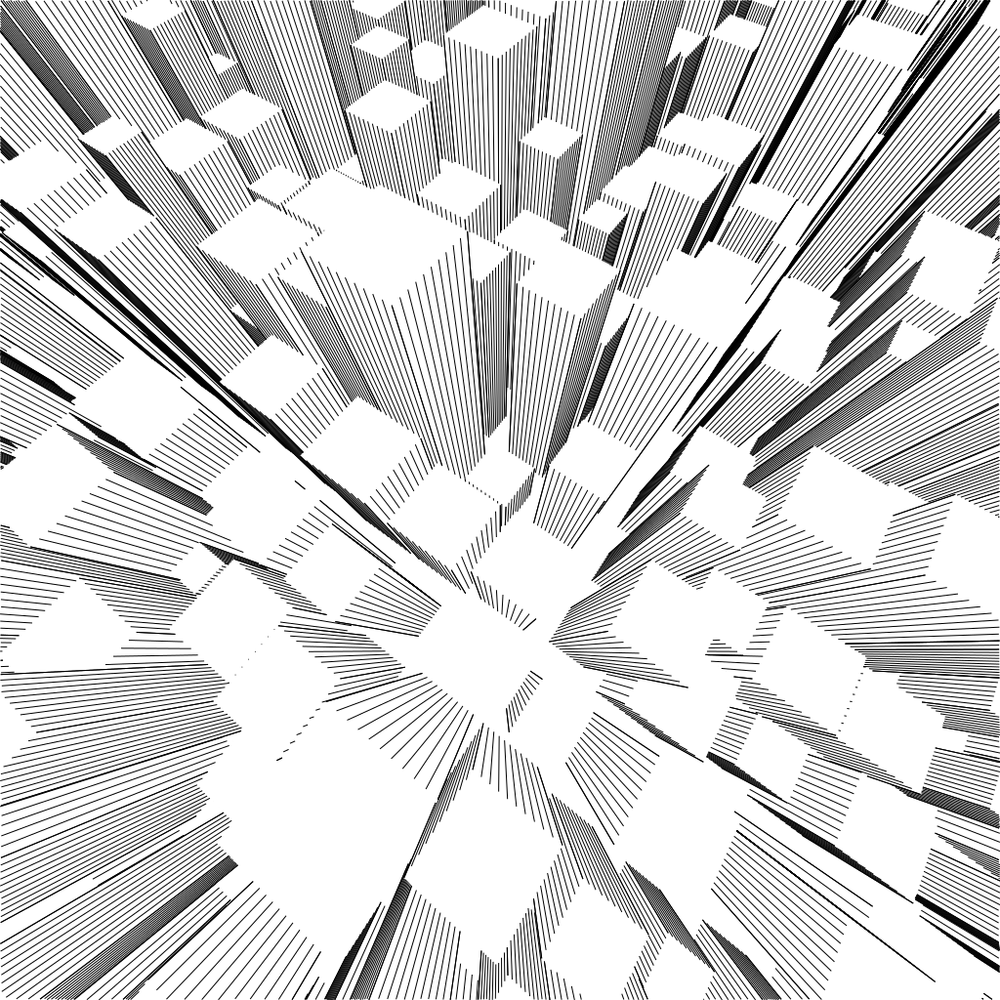

# linea

This is an attempt to port [Michael Fogleman's ln](https://github.com/fogleman/ln), 3d line engine to JavaScript (well, TypeScript).

The name of the port is inspired by the Italian cartoon from the 70s, [La Linea](https://en.wikipedia.org/wiki/La_Linea_(TV_series)).

## Setup

Project was made using node 12. We suggest using [nvm](https://github.com/nvm-sh/nvm). If you have nvm installed, just run `nvm use` in the root dir, to switch to version 12 (you need to install it first).

Then install dependencies

```
npm install
```

## Tests

```
npm test
```

To run tests in watch mode run:

```
npm test -- --watch
```

## How to run the "cube" example

Run

```
npm run cube
```

This will compile the example to `./dist/cube.js`. 
Now run:

```
node ./dist/cube.js
```

It will render SVG code in the terminal. To save it to file, just use 

```
node ./dist/cube.js > cube.svg
```

## Progress

* [x] axis.go
* [x] box.go - done but depends on the missing class `Triangle`
* [x] common.go
* [ ] cone.go - WIP
* [ ] csg.go
* [x] cube.go
* [ ] cylinder.go
* [x] filter.go
* [ ] function.go
* [x] hit.go
* [x] matrix.go
* [ ] mesh.go
* [ ] obj.go
* [x] path.go - missing `WriteTo*` methods, I think we should abstract it a little bit differently
* [ ] plane.go
* [x] ray.go
* [x] scene.go
* [x] shape.go
* [x] sphere.go
* [ ] stl.go
* [x] tree.go
* [ ] triangle.go
* [x] util.go
* [x] vector.go

The first SVG rendered by **linea**:


And the skyscrapers example (please note that this one uses code commented out in `source/cube.ts`):


